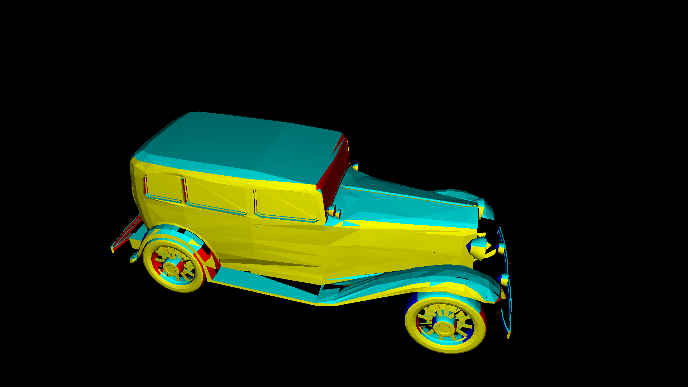
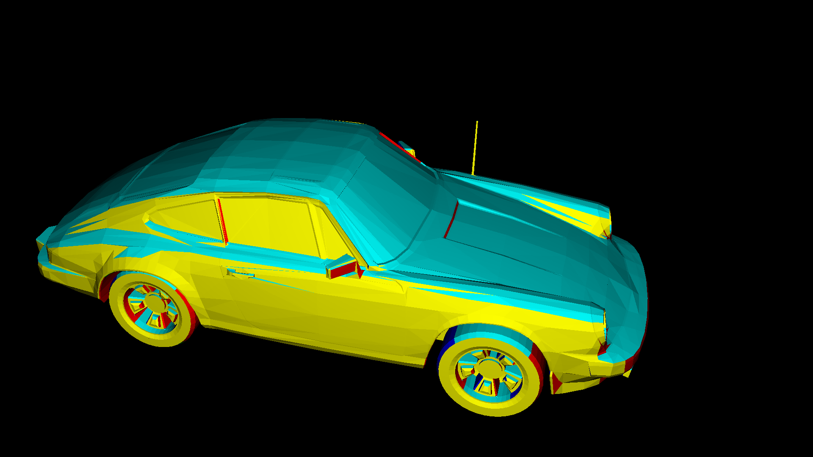
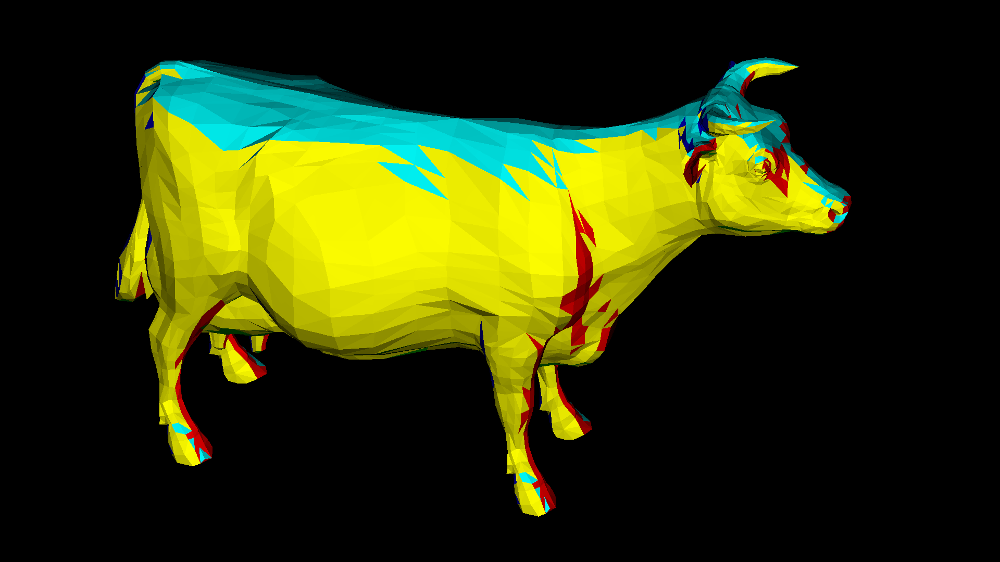
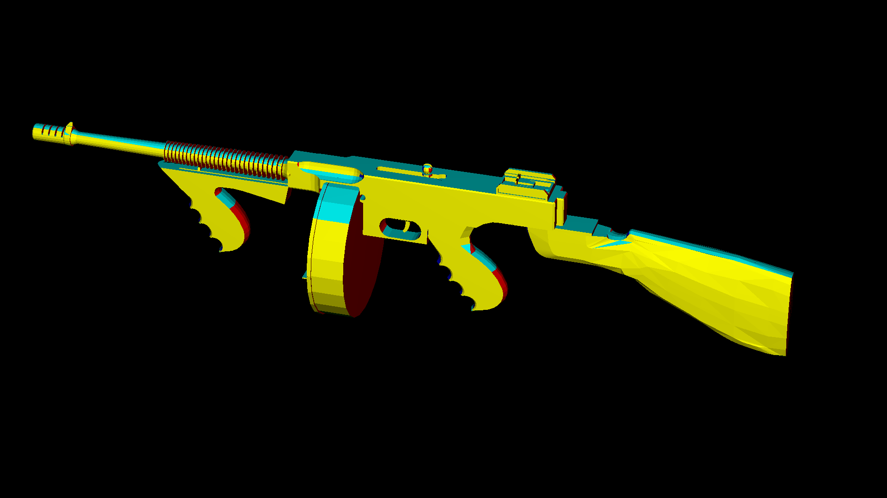

# CG-Renderer
## Finale Resultate





# Ausführen
```
git clone https://github.com/Skzter/CG-Renderer
cd CG-Renderer
make
./a.out 3 // 1,2,3,4 sind unterschiedliche auflösungen
./a.out 3 1 // zweite 1 speichert bild mit zeit und auflösung
```
Erscheint das Objekt nur zum Teil im Bild, dann muss man in der main.cpp die Parameter anpassen.
```
Vector3D eye = Vector3D(4.33, 10.5, -15); // auge anpassen 
Vector3D view = Vector3D(-0.3,-0.6,1); // sichtvektor anpassen
// X,Y,Z Koordinaten von Negativ zu Positiv => X: links, recht | Y: unten, oben | Z: vorne, hinten

float vw = 1.7; // viewwidth anpassen

test.lights = {
    Light(eye, 100, Color(255, 255, 255)) // weiter Lichter hier hinzufügen
};
```
